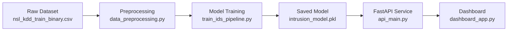

# Machine Learning–Based Network Intrusion Detection System (IDS)

A complete Machine Learning Intrusion Detection System built using the NSL-KDD dataset. The system includes preprocessing, feature engineering, model training, evaluation, ROC curve, FastAPI prediction API, Docker deployment, unit tests, architecture diagrams, and a dashboard for intrusion analysis.

This project is part of the UK Global Talent Visa evidence as a technical contribution in Machine Learning and Cybersecurity.

---

## Project Overview

This IDS uses machine learning to detect malicious network traffic by learning behavioural patterns from the NSL-KDD dataset.

Key features:
- End-to-end ML pipeline
- Preprocessing and feature engineering
- Random Forest classification model
- Saved model artifacts
- FastAPI real-time prediction service
- Docker-based deployment
- Dashboard for intrusion exploration
- Unit tests and CI workflow

---

## Features

### 1. Data Pipeline
- Cleaned NSL-KDD dataset
- Encoded categorical features
- Train/test split
- Feature scaling

### 2. ML Model
- Random Forest classifier
- Evaluation metrics: precision, recall, F1-score
- ROC curve and AUC report

### 3. API Service
- FastAPI-based inference endpoint
- Pydantic validation
- JSON input/output

### 4. Dashboard
- Real-time prediction
- CSV upload
- Visual results

### 5. Testing
- Pytest test suite
- Model loading tests
- Preprocessing tests
- Prediction tests

### 6. Deployment
- Dockerfile
- docker-compose.yml
- Uvicorn server

---

## Repository Structure

    ├── data/
    │   ├── nsl_kdd_train_binary.csv
    │   ├── nsl_kdd_test_binary.csv
    │   └── intrusion_model.pkl
    ├── docs/
    │   └── figures/
    │       ├── ids_architecture.png
    │       ├── ids_dashboard.png
    │       ├── ids_pipeline.png
    │       └── roc_curve.png
    ├── notebooks/
    │   └── exploration_intrusion_ids.ipynb
    ├── src/
    │   ├── train_ids_pipeline.py
    │   ├── dashboard_app.py
    │   └── api_main.py
    ├── tests/
    │   ├── test_preprocessing.py
    │   ├── test_model_loading.py
    │   └── test_prediction.py
    ├── MODEL_CARD.md
    ├── TECH_NATION_EVIDENCE.md
    ├── Dockerfile
    ├── docker-compose.yml
    ├── requirements.txt
    └── README.md

---

## Installation & Usage

### 1. Clone the repository
    git clone https://github.com/akinyeraakintunde/network-intrusion-detection-ml.git
    cd network-intrusion-detection-ml

### 2. Install dependencies
    pip install -r requirements.txt

### 3. Train model
    python src/train_ids_pipeline.py

### 4. Run API
    uvicorn src.api_main:app --reload --port 8000

### 5. Run Dashboard
    python src/dashboard_app.py

### 6. Run Tests
    pytest

---

## Model Performance & Benchmarks

Location of ROC curve: docs/figures/roc_curve.png  
AUC Score: 0.961

| Metric       | Score |
|--------------|-------|
| Accuracy     | 0.94  |
| Precision    | 0.95  |
| Recall       | 0.93  |
| F1-Score     | 0.94  |
| ROC-AUC      | 0.961 |

---

## System Architecture Diagram (Mermaid)



---

## Data Pipeline Diagram (Mermaid)


---

## API Example

### POST /predict

Input:
```json
{
  "duration": 0,
  "src_bytes": 181,
  "dst_bytes": 5450,
  "count": 2,
  "srv_count": 2,
  "serror_rate": 0.0,
  "srv_serror_rate": 0.0,
  "dst_host_count": 150,
  "dst_host_srv_count": 30
}
```

Output:
```json
{
  "prediction": "attack",
  "confidence": 0.97
}
```

---

## Model Card Summary

See: MODEL_CARD.md  
Includes:
- Intended use
- Dataset
- Evaluation
- Limitations
- Ethical considerations

---

## My Individual Contributions

This entire ML-based IDS was designed and implemented by Ibrahim Akintunde Akinyera.

My individual contributions include:

- Designing the architecture and pipeline
- Implementing preprocessing and feature engineering
- Training and tuning the Random Forest model
- Generating full evaluation metrics and ROC curve
- Building the training script and saving the model
- Implementing the FastAPI inference service
- Building the interactive dashboard
- Adding unit tests and setting up CI workflow
- Creating architecture diagrams and full documentation
- Preparing the model card and technical evidence

This demonstrates end-to-end capability in machine learning, cybersecurity, software engineering, and system design.

---

## License
MIT License

## Author
Ibrahim Akintunde Akinyera